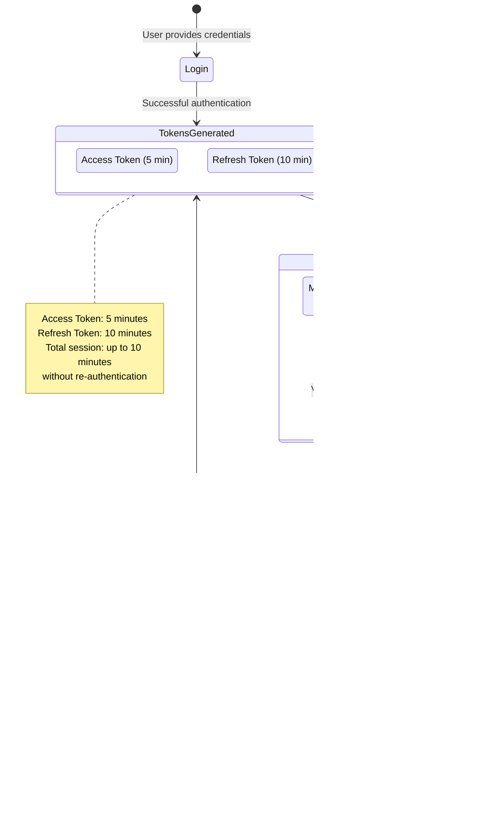
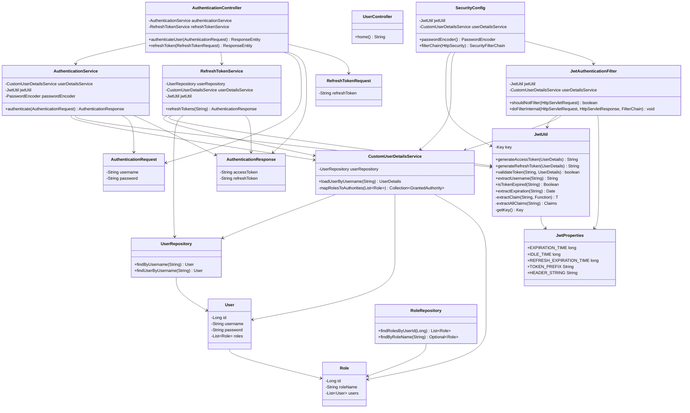

# תיעוד Stage 3—JWT with Refresh Tokens Documentation

## השוואה בין Stage 2 ל-Stage 3

### מה היה ב-Stage 2:
- JWT Access Token בלבד
- תוקף של 5 דקות
- אחרי תפוגה - צריך login מחדש
- AuthenticationResponse עם accessToken בלבד

### מה נוסף ב-Stage 3:
- **Refresh Token System** - מערכת חידוש tokens
- **Dual Token Strategy** - Access Token + Refresh Token
- **RefreshTokenService** - שירות לחידוש tokens
- **Endpoint חדש** - POST /api/refresh_token
- **Extended Sessions** - session ארוך יותר ללא login חוזר
- **Better UX** - משתמש לא מנותק כל 5 דקות

## ארכיטקטורת המערכת - System Architecture

## זרימת Dual Token Authentication - Dual Token Flow

## תרשים Token Lifecycle - Token Management

## תרשים מחלקות מעודכן - Updated Class Diagram

## הגדרות JWT מעודכנות - Updated JWT Configuration

## תרשים Data Flow המעודכן - Updated Data Flow

## השוואת התכונות - Feature Comparison

## מתודולוגיית Refresh Token ב-Stage 3

### 1. Initial Authentication
- משתמש מתחבר עם username/password
- מערכת מחזירה 2 tokens: Access (5 דקות) + Refresh (10 דקות)
- Client שומר את שני הtokens

### 2. API Usage Phase
- Client משתמש ב-Access Token לבקשות API
- כל בקשה מוצלחת מאריכה את השימוש
- לא צריך לחדש כלום כל עוד Access Token תקף

### 3. Access Token Expiration
- אחרי 5 דקות Access Token פג
- API calls מחזירים 401 Unauthorized
- Client מזהה שצריך לחדש token

### 4. Token Refresh Process
- Client שולח Refresh Token ל-/api/refresh_token
- מערכת בודקת תקינות וterm של Refresh Token
- אם תקף: מחזירה צמד tokens חדש
- אם פג: משתמש צריך להתחבר מחדש

### 5. Extended Session Management
- כל refresh מחזיר tokens חדשים
- מאפשר session רציף עד 10 דקות
- משפר UX משמעותית
- מקטין עומס על שרת authentication

## יתרונות Stage 3

### Security Benefits:
- **Short-lived Access Tokens** - חשיפה מוגבלת
- **Longer session duration** - UX טוב יותר
- **Token rotation** - tokens חדשים בכל refresh
- **Granular control** - שליטה נפרדת על כל סוג token

### User Experience Benefits:
- **Seamless usage** - פחות הפרעות למשתמש
- **Background refresh** - Client יכול לחדש אוטומטית
- **Extended sessions** - פחות logins חוזרים
- **Better mobile experience** - משמעותי לאפליקציות mobile

### Technical Benefits:
- **Scalable architecture** - מבנה יותר מתקדם
- **Industry standard** - OAuth 2.0 pattern
- **Flexible timing** - שליטה נפרדת בזמני תפוגה
- **Clear separation** - access vs refresh concerns

