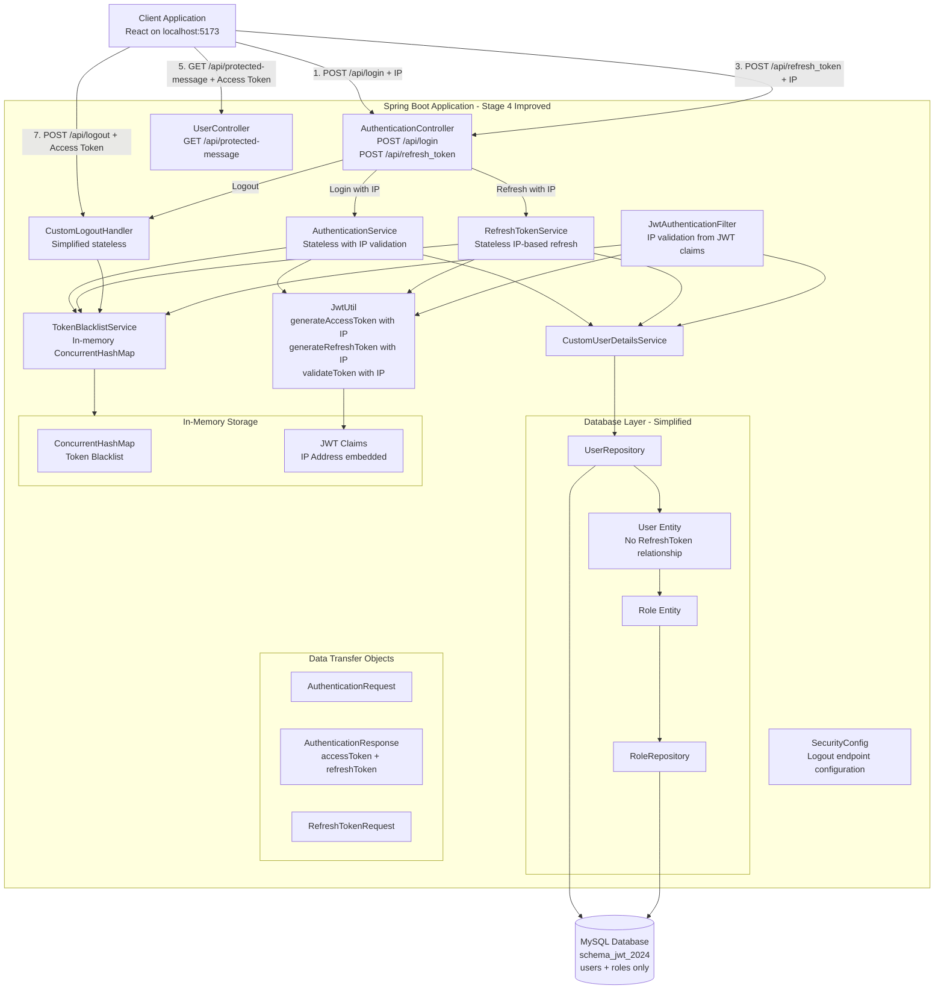
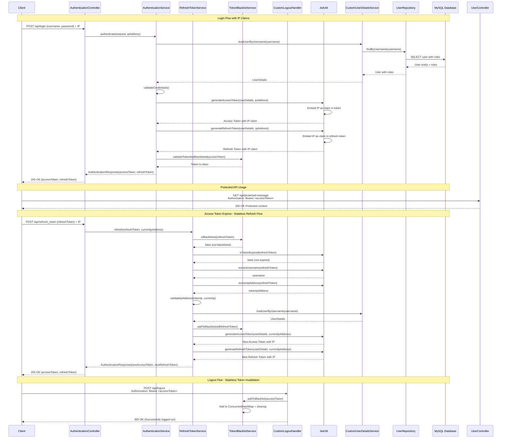
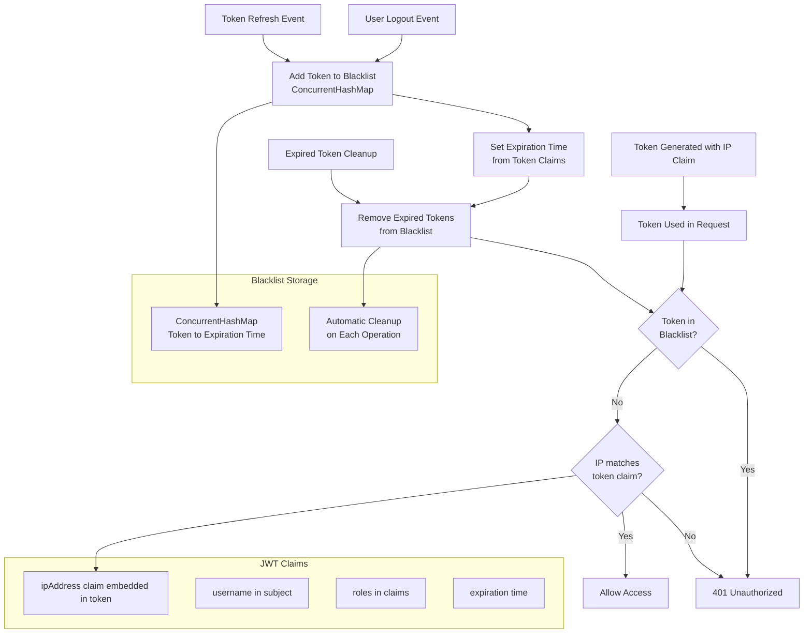
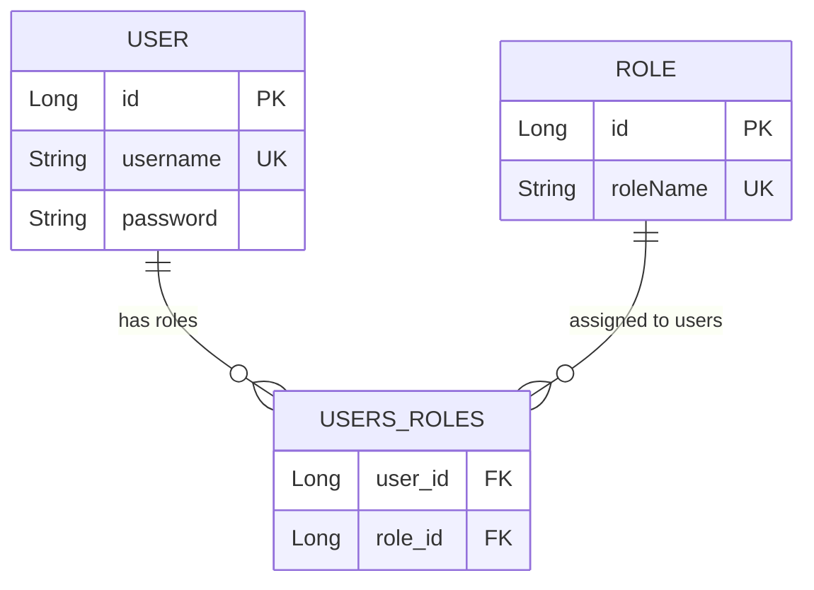
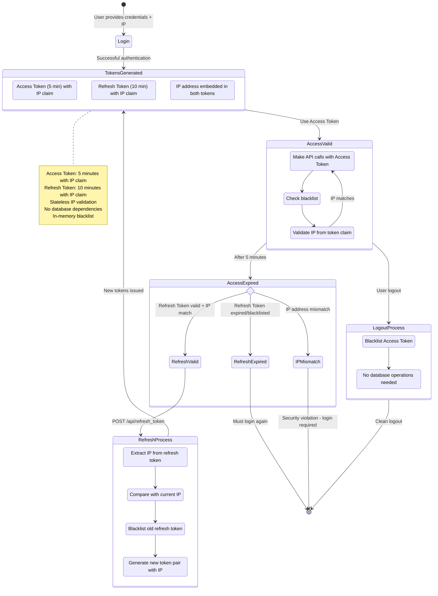
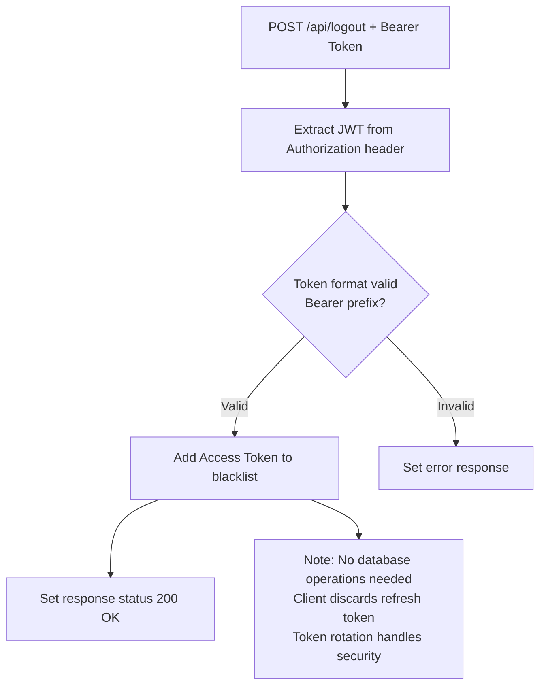
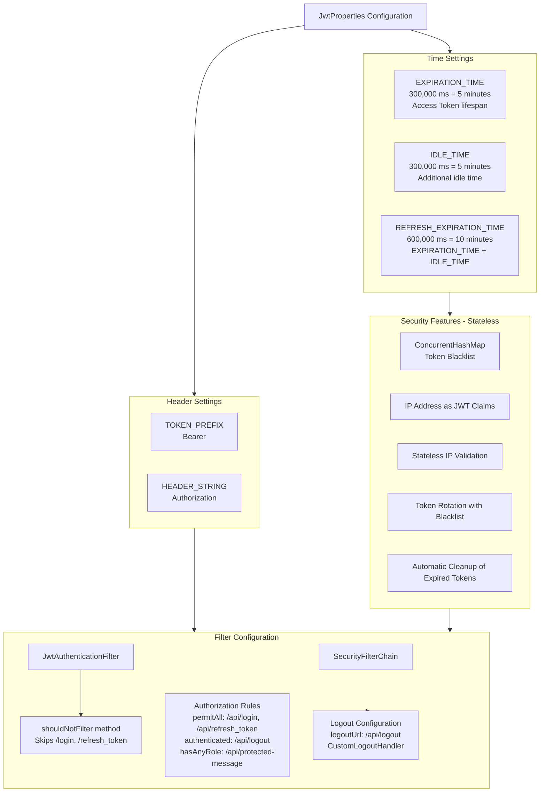
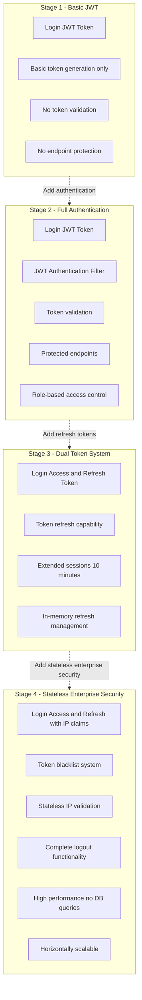

# תיעוד Stage 4 - JWT with Token Blacklist & Stateless IP Validation

## השוואה בין Stage 3 ל-Stage 4

### מה היה ב-Stage 3:
- Dual Token System (Access + Refresh)
- In-memory refresh token management
- Basic refresh token functionality
- AuthenticationResponse עם accessToken + refreshToken

### מה נוסף ב-Stage 4:
- **Token Blacklist System** - רשימה שחורה של tokens
- **Stateless IP Validation** - IP נטמע כ-claims ב-JWT tokens
- **Logout Functionality** - התנתקות מלאה עם ביטול tokens
- **Enhanced Security** - validations נוספות וhardening
- **Full Stateless Architecture** - אין database dependencies לtokens
- **Performance Optimization** - מהירות גבוהה ללא DB queries

## ארכיטקטורת המערכת - System Architecture

## זרימת Full Lifecycle Authentication - Stateless Flow

## תרשים Token Blacklist Management

## תרשים Database Schema - Simplified

## תרשים מחלקות מעודכן - Updated Class Diagram

```mermaid
classDiagram
    class AuthenticationController {
        -AuthenticationService authenticationService
        -RefreshTokenService refreshTokenService
        +authenticateUser(AuthenticationRequest, HttpServletRequest) ResponseEntity
        +refreshToken(RefreshTokenRequest, HttpServletRequest) ResponseEntity
    }
    
    class UserController {
        +home() String
    }
    
    class AuthenticationService {
        -CustomUserDetailsService customUserDetailsService
        -JwtUtil jwtUtil
        -PasswordEncoder passwordEncoder
        -TokenBlacklistService tokenBlacklistService
        +authenticate(AuthenticationRequest, String) AuthenticationResponse
        -validateCredentials(String, String) void
        -validateTokenNotBlacklisted(String) void
    }
    
    class RefreshTokenService {
        -CustomUserDetailsService customUserDetailsService
        -JwtUtil jwtUtil
        -TokenBlacklistService tokenBlacklistService
        +refresh(String, String) AuthenticationResponse
    }
    
    class TokenBlacklistService {
        -JwtUtil jwtUtil
        -ConcurrentHashMap~String, Instant~ blacklist
        +addToBlacklist(String) void
        +isBlacklisted(String) boolean
        -removeExpiredTokens() void
    }
    
    class CustomLogoutHandler {
        -TokenBlacklistService tokenBlacklistService
        +onLogoutSuccess(HttpServletRequest, HttpServletResponse, Authentication) void
    }
    
    class CustomUserDetailsService {
        -UserRepository userRepository
        +loadUserByUsername(String) UserDetails
        -mapRolesToAuthorities(List~Role~) Collection~GrantedAuthority~
    }
    
    class JwtUtil {
        -Key key
        +generateAccessToken(UserDetails, String) String
        +generateRefreshToken(UserDetails, String) String
        +validateToken(String, UserDetails, String) boolean
        +validateToken(String, UserDetails) boolean
        +extractUsername(String) String
        +extractIpAddress(String) String
        +isTokenExpired(String) Boolean
        +extractExpiration(String) Date
        -extractClaim(String, Function) T
        -extractAllClaims(String) Claims
        -getKey() Key
    }
    
    class JwtAuthenticationFilter {
        -JwtUtil jwtUtil
        -CustomUserDetailsService customUserDetailsService
        -TokenBlacklistService tokenBlacklistService
        +shouldNotFilter(HttpServletRequest) boolean
        +doFilterInternal(HttpServletRequest, HttpServletResponse, FilterChain) void
    }
    
    class SecurityConfig {
        -JwtUtil jwtUtil
        -CustomUserDetailsService userDetailsService
        -CustomLogoutHandler customLogoutHandler
        -TokenBlacklistService tokenBlacklistService
        +passwordEncoder() PasswordEncoder
        +filterChain(HttpSecurity) SecurityFilterChain
    }
    
    class User {
        -Long id
        -String username
        -String password
        -List~Role~ roles
    }
    
    class Role {
        -Long id
        -String roleName
        -List~User~ users
    }
    
    class AuthenticationRequest {
        -String username
        -String password
    }
    
    class AuthenticationResponse {
        -String accessToken
        -String refreshToken
    }
    
    class RefreshTokenRequest {
        -String refreshToken
    }
    
    class JwtProperties {
        +EXPIRATION_TIME long
        +IDLE_TIME long
        +REFRESH_EXPIRATION_TIME long
        +TOKEN_PREFIX String
        +HEADER_STRING String
    }
    
    class UserRepository {
        +findByUsername(String) User
        +findUserByUsername(String) User
    }
    
    class RoleRepository {
        +findRolesByUserId(Long) List~Role~
        +findByRoleName(String) Optional~Role~
    }
    
    AuthenticationController --> AuthenticationService
    AuthenticationController --> RefreshTokenService
    AuthenticationController --> AuthenticationRequest
    AuthenticationController --> AuthenticationResponse
    AuthenticationController --> RefreshTokenRequest
    
    AuthenticationService --> CustomUserDetailsService
    AuthenticationService --> JwtUtil
    AuthenticationService --> TokenBlacklistService
    AuthenticationService --> AuthenticationRequest
    AuthenticationService --> AuthenticationResponse
    
    RefreshTokenService --> CustomUserDetailsService
    RefreshTokenService --> JwtUtil
    RefreshTokenService --> TokenBlacklistService
    RefreshTokenService --> AuthenticationResponse
    
    TokenBlacklistService --> JwtUtil
    
    CustomLogoutHandler --> TokenBlacklistService
    
    CustomUserDetailsService --> UserRepository
    CustomUserDetailsService --> User
    CustomUserDetailsService --> Role
    
    JwtUtil --> JwtProperties
    
    JwtAuthenticationFilter --> JwtUtil
    JwtAuthenticationFilter --> CustomUserDetailsService
    JwtAuthenticationFilter --> TokenBlacklistService
    JwtAuthenticationFilter --> JwtProperties
    
    SecurityConfig --> JwtUtil
    SecurityConfig --> CustomUserDetailsService
    SecurityConfig --> CustomLogoutHandler
    SecurityConfig --> TokenBlacklistService
    SecurityConfig --> JwtAuthenticationFilter
    
    UserRepository --> User
    RoleRepository --> Role
    User --> Role
```

## תרשים Token Lifecycle Management - Stateless

## זרימת ה-Logout Process - Simplified

## הגדרות JWT מעודכנות ב-Stage 4

## השוואת התכונות - All Stages Comparison

## מתודולוגיית האבטחה ב-Stage 4 Improved

### 1. Stateless Token Blacklist System
- **ConcurrentHashMap** לשמירת tokens מבוטלים
- **Automatic cleanup** של tokens שפגו
- **Thread-safe operations** למכירה concurrent
- **Memory efficient** - מסיר tokens expired אוטומטית
- **אין database dependencies** - performance מעולה

### 2. JWT Claims-based IP Validation
- **IP נטמע כ-claim** בתוך הtoken עצמו
- **Stateless validation** - בדיקת IP מתוך הtoken
- **אין צורך במסד נתונים** לvalidation
- **Token self-contained** - כל המידע בtoken

### 3. Enhanced Security without Database
- **IP validation** מובנה בכל token
- **Token rotation** עם blacklist mechanism
- **אין persistent storage** של sensitive data
- **Immediate token revocation** עם blacklist

### 4. Simplified Logout Process
- **רק blacklist** של access token
- **אין database cleanup** נדרש
- **Client responsibility** לזרוק refresh token
- **מהיר ויעיל** ללא DB operations

### 5. Performance & Scalability Benefits
- **אין database queries** לtoken validation
- **מהירות גבוהה** בvalidation
- **Horizontal scaling** ללא בעיות
- **Stateless architecture** מושלמת

## יתרונות Stage 4 Improved

### Enterprise-Ready Performance:
- **גבוה ביותר** - אין DB overhead לtokens
- **Stateless scaling** - unlimited horizontal scaling
- **Memory efficient** - רק blacklist cache
- **Thread-safe** - ConcurrentHashMap operations

### Production Benefits:
- **אין database bottlenecks** לtoken operations
- **מהירות תגובה מעולה** - validation מהיר
- **פשטות deployment** - פחות moving parts
- **Enhanced reliability** - פחות failure points

### Security Excellence:
- **IP validation** מובנה ומהיר
- **Token revocation** מיידי עם blacklist
- **אין data leakage** במסד נתונים
- **Perfect JWT implementation** - self-contained tokens

### Developer Experience:
- **קוד פשוט יותר** - פחות complexity
- **קל לתחזוקה** - פחות moving parts
- **Easy debugging** - כל המידע בtoken
- **Industry standard** - עקבי עם JWT best practices

