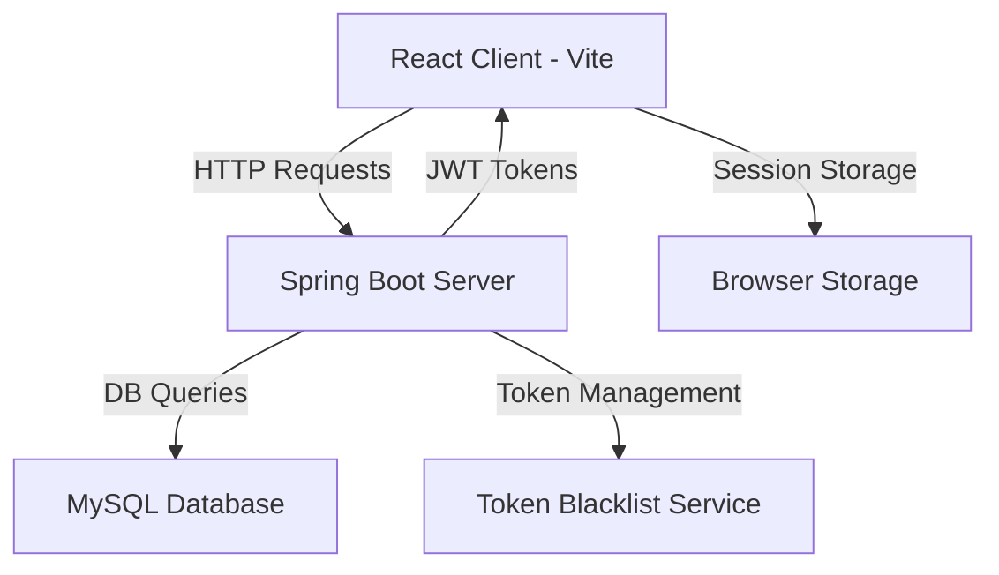
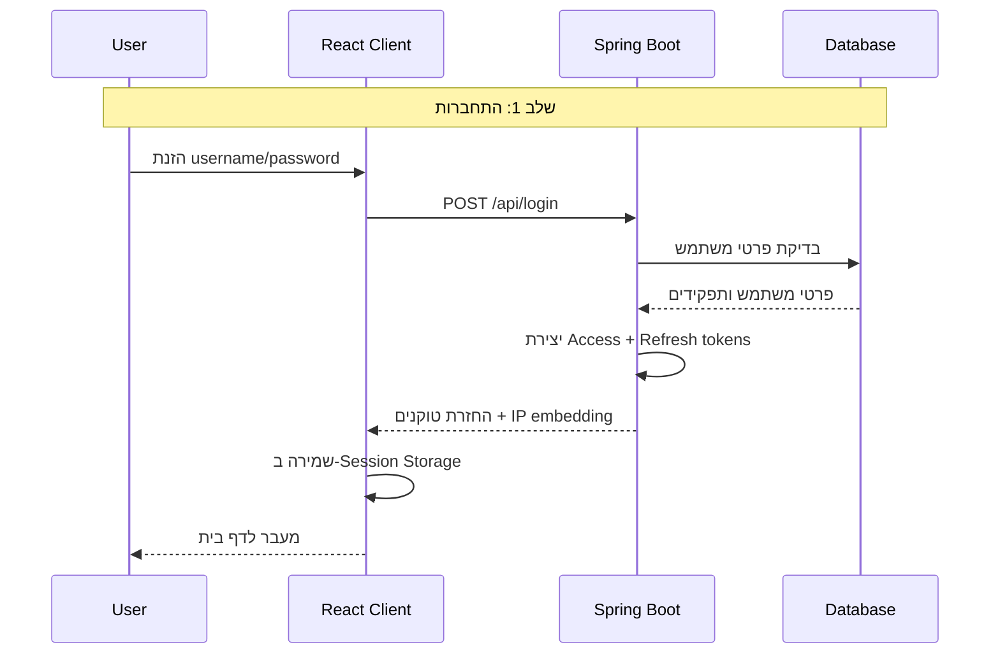
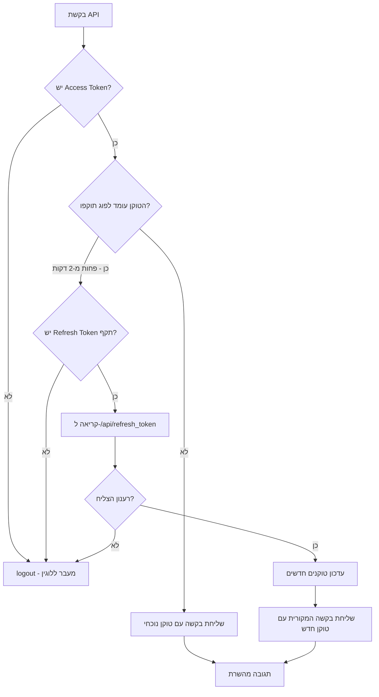
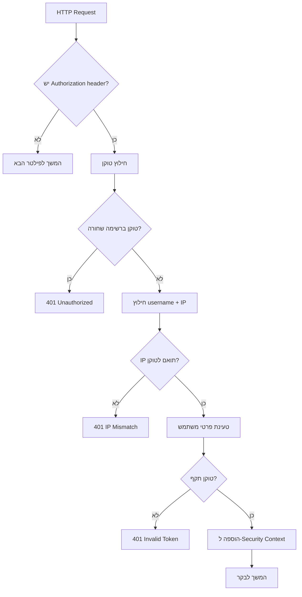
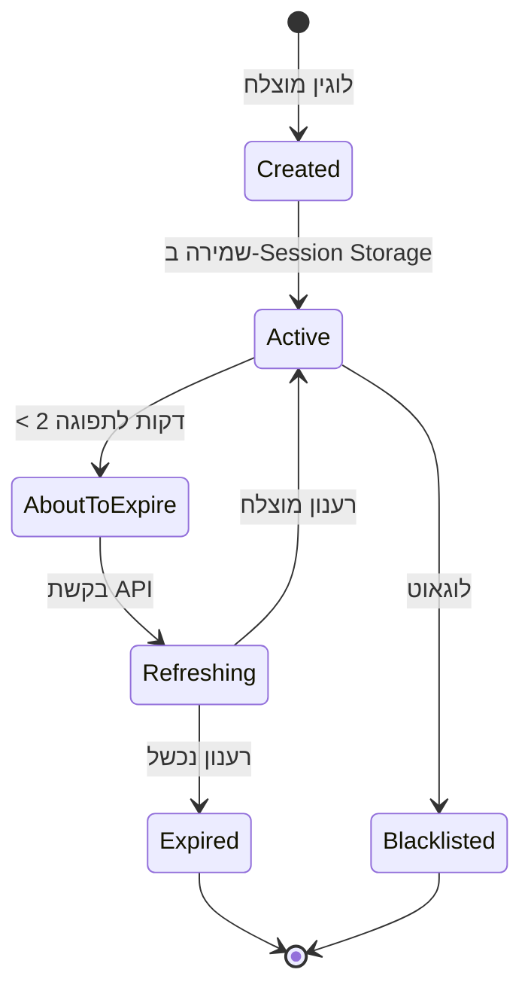
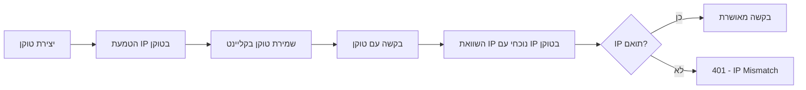
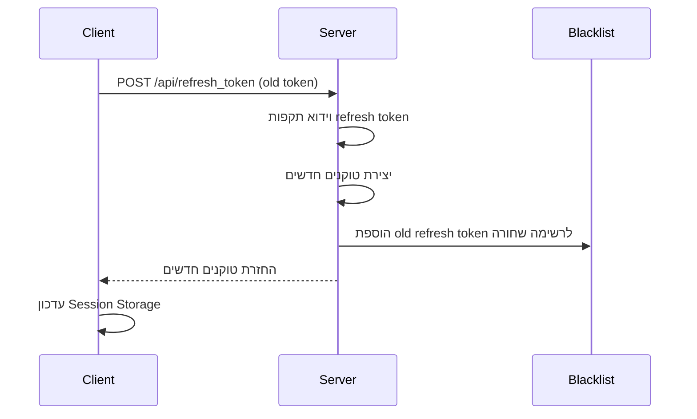
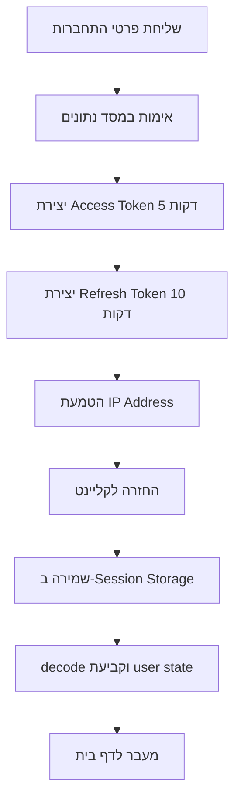
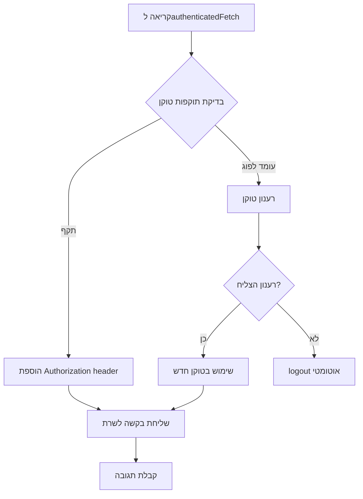
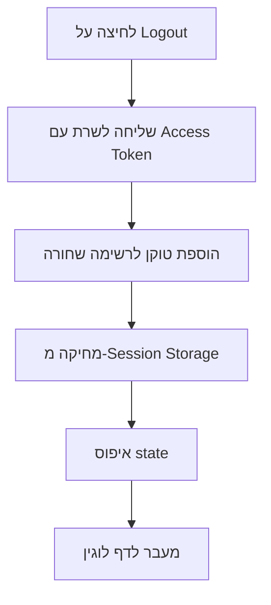

<div dir="rtl">

# סיכום אפליקציית React JWT - Stage4-React-Vite

## תיאור כללי

אפליקציית React מודרנית עם אימות JWT מלא, שנבנתה עם Vite. המערכת כוללת אבטחה מתקדמת עם IP validation, token blacklist, ורענון אוטומטי של טוקנים.

## ארכיטקטורה כללית

</div>



<div dir="rtl">

## מבנה הפרויקט

### קבצי React (Client)

</div>

```
Stage4-React-Vite/
├── package.json
├── vite.config.js
├── index.html
└── src/
    ├── main.jsx              # Entry point
    ├── App.jsx               # רכיב ראשי
    ├── index.css             # CSS גלובלי
    ├── AuthContext.jsx       # ניהול אימות
    ├── ProtectedRoute.jsx    # הגנה על נתיבים
    ├── Login.jsx             # דף לוגין
    ├── Home.jsx              # דף בית
    └── TokenDisplay.jsx      # הצגת טוקנים
```

<div dir="rtl">

### קבצי Spring Boot (Server)

</div>

```
Stage4/
├── JwtAuthenticationFilter.java    # פילטר אימות
├── JwtUtil.java                   # ניהול JWT
├── AuthenticationController.java  # בקר אימות
├── AuthenticationService.java     # שירות אימות
├── TokenBlacklistService.java     # רשימה שחורה
└── SecurityConfig.java            # הגדרות אבטחה
```

<div dir="rtl">

## זרימת אימות מלאה

</div>



<div dir="rtl">

## מנגנון ה-Wrapper (Activity-Based Token Refresh)

</div>



<div dir="rtl">

## רכיבי React עיקריים

### AuthContext.jsx - הלב של המערכת

</div>

```javascript
// ניהול state גלובלי של אימות
const AuthContext = createContext();

export const AuthProvider = ({ children }) => {
  const [user, setUser] = useState(null);
  const [accessToken, setAccessToken] = useState(null);
  const [refreshToken, setRefreshToken] = useState(null);
  
  // authenticatedFetch - הWrapper שבודק טוקנים
  const authenticatedFetch = async (url, options = {}) => {
    // בדיקת תוקפות טוקן רק לפני בקשה
    // רענון אוטומטי אם נדרש
  };
};
```

<div dir="rtl">

**תפקידים עיקריים:**
- ניהול מצב המשתמש והטוקנים
- Wrapper לכל בקשות ה-API
- רענון אוטומטי של טוקנים
- טיפול בתפוגת טוקנים

### Login.jsx - דף הכניסה

</div>

```javascript
const Login = () => {
  const [username, setUsername] = useState('');
  const [password, setPassword] = useState('');
  const { login } = useAuth();
  
  const handleSubmit = async (e) => {
    const result = await login(username, password);
    // טיפול בתוצאה
  };
};
```

<div dir="rtl">

**תכונות:**
- עיצוב פשוט ונקי
- validation של שדות
- הודעות שגיאה ברורות
- Enter key support

### Home.jsx - דף הבית הראשי

</div>

```javascript
const Home = () => {
  const { user, accessToken, refreshToken, logout } = useAuth();
  const [protectedMessage, setProtectedMessage] = useState('');
  
  useEffect(() => {
    // טעינת הודעה מוגנת רק פעם אחת
    if (accessToken && !protectedMessage) {
      fetchProtectedMessage();
    }
  }, [accessToken]);
};
```

<div dir="rtl">

**תכונות:**
- הצגת פרטי משתמש
- פאנל אדמין מיוחד
- הצגת טוקנים עם זמן תפוגה
- כפתורי Refresh ו-Logout

### TokenDisplay.jsx - הצגת מידע טוקנים

</div>

```javascript
const TokenDisplay = ({ token, label }) => {
  const [timeLeft, setTimeLeft] = useState('');
  
  useEffect(() => {
    // חישוב זמן שנותר רק פעם אחת בטעינה
    if (token) {
      const decoded = jwtDecode(token);
      // חישוב זמן ללא timer
    }
  }, [token]);
};
```

<div dir="rtl">

**תכונות:**
- הצגת זמן שנותר בטעינת דף
- ללא timers - ביצועים טובים
- הצגת חלק מהטוקן
- עיצוב מינימלי

## צד השרת - Spring Boot

</div>

### JwtAuthenticationFilter.java



<div dir="rtl">

### מחזור חיי טוקנים

</div>



<div dir="rtl">

### TokenBlacklistService.java

</div>


```java
@Service
public class TokenBlacklistService {
    private final ConcurrentHashMap<String, Instant> blacklist = new ConcurrentHashMap<>();
    
    public void addToBlacklist(String token) {
        // הוספת טוקן לרשימה שחורה
        Instant expirationTime = jwtUtil.extractExpiration(token).toInstant();
        blacklist.put(token, expirationTime);
        removeExpiredTokens(); // ניקוי טוקנים שפגו
    }
    
    public boolean isBlacklisted(String token) {
        // בדיקה אם טוקן ברשימה שחורה
    }
}
```

<div dir="rtl">

## תכונות אבטחה מתקדמות

</div>

### IP Validation



<div dir="rtl">

**יתרונות:**
- מניעת גניבת טוקנים
- הגנה מפני XSS/CSRF
- אבטחה נוספת מעבר לחתימה

### Token Rotation במערכת הרענון


</div>



<div dir="rtl">

## זרימת נתונים במערכת

### לוגין מוצלח

</div>



<div dir="rtl">

### בקשת API רגילה עם Wrapper

</div>



<div dir="rtl">

### תהליך לוגאוט

</div>



<div dir="rtl">

## טכנולוגיות ושיטות עבודה

</div>

### Frontend (React)

```javascript
// Vite Configuration
export default defineConfig({
  plugins: [react()],
  server: {
    proxy: {
      '/api': {
        target: 'http://localhost:8080',
        changeOrigin: true,
        secure: false,
      }
    }
  }
})
```

<div dir="rtl">

**תכונות:**
- **Vite** - bundler מהיר
- **React 18** - ללא StrictMode (למניעת קריאות כפולות)
- **Context API** - ניהול state גלובלי
- **Session Storage** - אחסון מקומי זמני
- **CSS-in-JS** - עיצוב מינימלי

### Backend (Spring Boot)

**תכונות:**
- **JWT** - אימות stateless
- **Spring Security** - מסגרת אבטחה
- **JPA/Hibernate** - ORM
- **MySQL** - מסד נתונים
- **CORS** - הגדרות cross-origin

## יתרונות המערכת

### אבטחה
- **IP Validation** - הגנה מפני גניבת טוקנים
- **Token Blacklist** - ביטול מיידי של טוקנים
- **Token Rotation** - טוקנים מתחדשים בכל רענון
- **Stateless** - אין תלות בsessions

### ביצועים
- **Activity-Based Refresh** - רענון רק כשצריך
- **No Timers** - חיסכון במשאבי CPU
- **Session Storage** - מהיר יותר מLocal Storage
- **Minimal CSS** - טעינה מהירה

### חוויית משתמש
- **רענון שקוף** - המשתמש לא מרגיש
- **הודעות שגיאה ברורות**
- **עיצוב responsive**
- **נגישות טובה**

## סיכום

המערכת מספקת פתרון מלא ומאובטח לאימות JWT עם React ו-Spring Boot. היא כוללת את כל התכונות הנדרשות למערכת production:

- אימות מאובטח עם IP validation
- רענון אוטומטי של טוקנים
- ניהול מצב מתקדם
- עיצוב פשוט ונקי
- ביצועים מעולים
- אבטחה מרובת שכבות

הקוד נכתב בצורה פשוטה וברורה, עם הפרדה נכונה בין הרכיבים ועקרונות clean code.

</div>