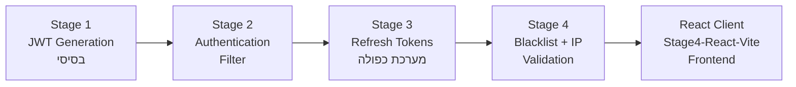
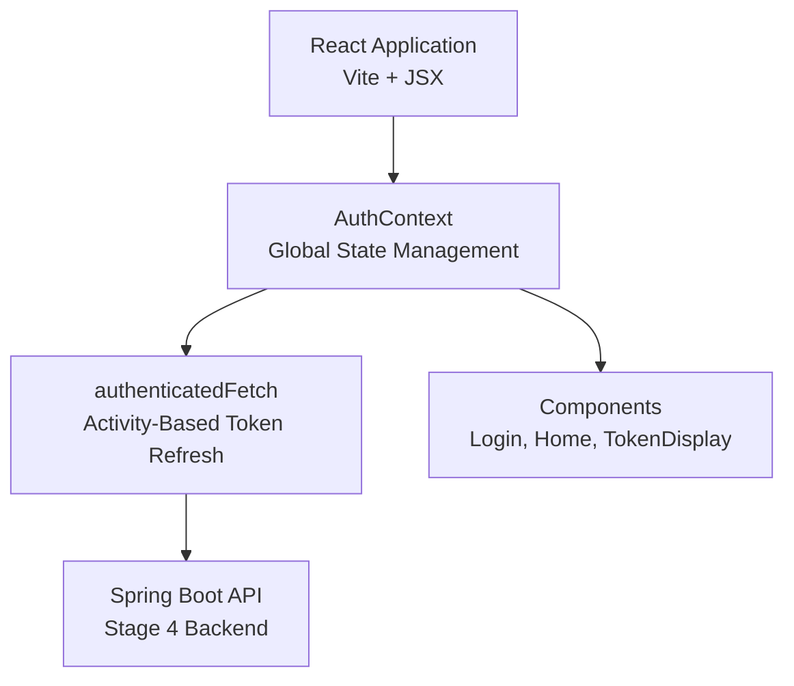
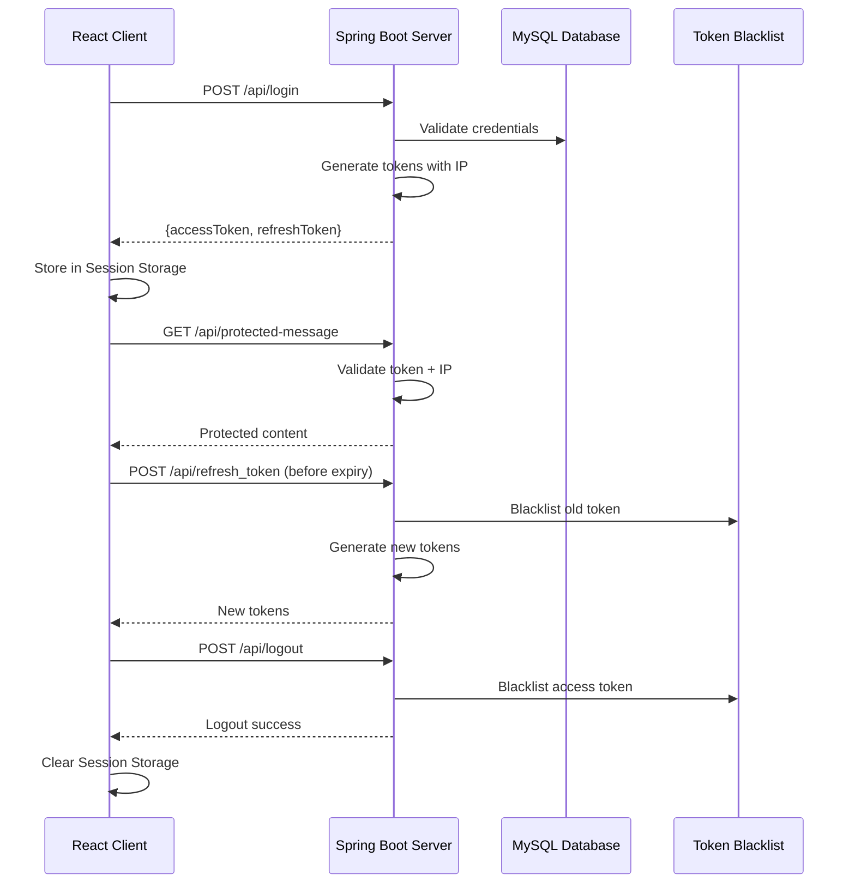

<div dir="rtl">

# סיכום מערכת JWT - התפתחות שלבית מ-Stage 1 עד Stage 4 + React Client

## מבנה הפרויקט הכללי

### Multi-Module Maven Structure

</div>

```
JwtSecurity2024/                    (Parent POM)
├── pom.xml                        (Parent עם כל התלויות)
├── Stage1/                        (JWT בסיסי)
├── Stage2/                        (אימות מלא)
├── Stage3/                        (Refresh Tokens)
├── Stage4/                        (Token Blacklist + IP Validation)
└── Stage4-React-Vite/            (React Client Application)
```

<div dir="rtl">

### Dependencies עיקריות - Parent POM

</div>

```xml
<!-- JWT Dependencies - יצירה ואימות של JWT tokens -->
<dependency>
    <groupId>io.jsonwebtoken</groupId>
    <artifactId>jjwt</artifactId>                    <!-- Main JWT library -->
    <version>0.12.6</version>
</dependency>
<dependency>
    <groupId>io.jsonwebtoken</groupId>
    <artifactId>jjwt-api</artifactId>                <!-- JWT API interfaces -->
    <version>0.12.6</version>
</dependency>
<dependency>
    <groupId>io.jsonwebtoken</groupId>
    <artifactId>jjwt-impl</artifactId>               <!-- JWT implementation -->
    <version>0.12.6</version>
    <scope>runtime</scope>
</dependency>
<dependency>
    <groupId>io.jsonwebtoken</groupId>
    <artifactId>jjwt-jackson</artifactId>            <!-- JSON parsing for JWT -->
    <version>0.12.6</version>
    <scope>runtime</scope>
</dependency>

<!-- Spring Boot Starters - מודולים עיקריים -->
<dependency>
    <groupId>org.springframework.boot</groupId>
    <artifactId>spring-boot-starter-data-jpa</artifactId>  <!-- JPA + Hibernate ORM -->
</dependency>
<dependency>
    <groupId>org.springframework.boot</groupId>
    <artifactId>spring-boot-starter-security</artifactId>  <!-- Spring Security framework -->
</dependency>
<dependency>
    <groupId>org.springframework.boot</groupId>
    <artifactId>spring-boot-starter-web</artifactId>       <!-- Web MVC + Tomcat server -->
</dependency>

<!-- Database & Utilities - מסד נתונים וכלים -->
<dependency>
    <groupId>com.mysql</groupId>
    <artifactId>mysql-connector-j</artifactId>             <!-- MySQL JDBC driver -->
</dependency>
<dependency>
    <groupId>org.projectlombok</groupId>
    <artifactId>lombok</artifactId>                        <!-- Auto-generate getters/setters -->
</dependency>
```

<div dir="rtl">

### הסבר Dependencies:

**JWT Dependencies:**
- **jjwt** - תלות ראשי ליצירת ואימות JWT tokens
- **jjwt-api** - ממשקים וDefinitions עבור JWT
- **jjwt-impl** - המימוש הפנימי של ה-JWT operations
- **jjwt-jackson** - תמיכה ב-JSON parsing עבור JWT payload

**Spring Boot Starters:**
- **data-jpa** - JPA + Hibernate לעבודה עם מסד נתונים
- **security** - Spring Security לאימות והרשאות
- **web** - Spring MVC + Tomcat server מובנה

**Database & Utilities:**
- **mysql-connector-j** - Driver להתחברות ל-MySQL
- **lombok** - יצירה אוטומטית של getters, setters, constructors

## השתלשלות השלבים - Evolution Timeline

</div>



<div dir="rtl">

### Stage 1 - JWT Generation בסיסי

**מה היה:**
- יצירת JWT tokens בלבד
- אין אימות של tokens
- endpoints לא מוגנים בפועל

**רכיבים עיקריים:**
- `JwtUtil` - יצירת tokens
- `AuthenticationController` - login endpoint
- `SecurityConfig` - הגדרות בסיסיות

### Stage 2 - Complete Authentication System

**מה נוסף:**
- `JwtAuthenticationFilter` - עיבוד tokens בכל בקשה
- אימות מלא של tokens
- הגנה על endpoints
- Role-based access control

**רכיבים חדשים:**
- `JwtAuthenticationFilter`
- `JwtProperties` (TOKEN_PREFIX, HEADER_STRING)
- `UserController` - protected endpoints
- תמיכה ב-Authorization headers

**זרימת אימות:**

</div>

```
Client → JwtFilter → Token Validation → SecurityContext → Protected Endpoint
```

<div dir="rtl">

### Stage 3 - Dual Token System

**מה נוסף:**
- מערכת Refresh Tokens
- Access Token (5 דקות) + Refresh Token (10 דקות)
- `RefreshTokenService`
- שיפור חוויית משתמש

**רכיבים חדשים:**
- `RefreshTokenService`
- `RefreshTokenRequest` DTO
- `/api/refresh_token` endpoint
- `REFRESH_EXPIRATION_TIME` configuration

**יתרונות:**
- sessions ארוכים יותר
- פחות logins חוזרים
- UX משופר

### Stage 4 - Enterprise Security + Stateless Architecture

**מה נוסף:**
- `TokenBlacklistService` - רשימה שחורה
- IP Validation נטמע ב-JWT claims
- `CustomLogoutHandler` - logout מלא
- ארכיטקטורה stateless מלאה

**רכיבים חדשים:**
- `TokenBlacklistService` (ConcurrentHashMap)
- `CustomLogoutHandler`
- IP claims ב-JWT tokens
- `/api/logout` endpoint

**תכונות מתקדמות:**
- מניעת שימוש חוזר בtokens
- אבטחת IP addresses
- ביצועים גבוהים ללא DB queries
- Horizontal scaling מלא

## React Client - Stage4-React-Vite

### ארכיטקטורה

</div>



<div dir="rtl">

### רכיבים עיקריים

**AuthContext.jsx:**

</div>

```javascript
// ניהול state גלובלי של אימות
const AuthContext = createContext();

export const AuthProvider = ({ children }) => {
  const [user, setUser] = useState(null);
  const [accessToken, setAccessToken] = useState(null);
  const [refreshToken, setRefreshToken] = useState(null);
  
  // authenticatedFetch - הWrapper שבודק טוקנים
  const authenticatedFetch = async (url, options = {}) => {
    // בדיקת תוקפות טוקן רק לפני בקשה
    // רענון אוטומטי אם נדרש
  };
};
```

<div dir="rtl">

**Login.jsx:**

</div>

```javascript
const Login = () => {
  const [username, setUsername] = useState('');
  const [password, setPassword] = useState('');
  const { login } = useAuth();
  
  const handleSubmit = async (e) => {
    const result = await login(username, password);
    // טיפול בתוצאה
  };
};
```

<div dir="rtl">

**Home.jsx:**

</div>

```javascript
const Home = () => {
  const { user, accessToken, refreshToken, logout } = useAuth();
  const [protectedMessage, setProtectedMessage] = useState('');
  
  useEffect(() => {
    // טעינת הודעה מוגנת רק פעם אחת
    if (accessToken && !protectedMessage) {
      fetchProtectedMessage();
    }
  }, [accessToken]);
};
```

<div dir="rtl">

**TokenDisplay.jsx:**

</div>

```javascript
const TokenDisplay = ({ token, label }) => {
  const [timeLeft, setTimeLeft] = useState('');
  
  useEffect(() => {
    // חישוב זמן שנותר רק פעם אחת בטעינה
    if (token) {
      const decoded = jwtDecode(token);
      // חישוב זמן ללא timer
    }
  }, [token]);
};
```

<div dir="rtl">

### תכונות מיוחדות

**Activity-Based Token Refresh:**

</div>

```javascript
// בדיקה רק לפני API calls
if (timeUntilExpiry < 120000) { // 2 minutes
    const newToken = await refreshToken();
    // שימוש בטוקן חדש
}
```

<div dir="rtl">

**Session Storage Management:**

</div>

```javascript
// שמירת tokens
sessionStorage.setItem('accessToken', data.accessToken);
sessionStorage.setItem('refreshToken', data.refreshToken);

// ניקוי בלוגאוט
sessionStorage.removeItem('accessToken');
sessionStorage.removeItem('refreshToken');
```

<div dir="rtl">

## הקשר בין Backend ו-Frontend

### זרימת אימות מלאה

</div>



<div dir="rtl">

### אינטגרציה מושלמת

**Vite Proxy Configuration:**

</div>

```javascript
export default defineConfig({
  plugins: [react()],
  server: {
    proxy: {
      '/api': {
        target: 'http://localhost:8080',
        changeOrigin: true,
        secure: false,
      }
    }
  }
})
```

<div dir="rtl">

**CORS Configuration (Backend):**

</div>

```java
.cors(cors -> {
    cors.configurationSource(request -> {
        var corsConfig = new CorsConfiguration();
        corsConfig.setAllowedOrigins(List.of("http://localhost:5173"));
        corsConfig.setAllowedMethods(List.of("GET", "POST", "PUT", "DELETE", "OPTIONS"));
        corsConfig.setAllowedHeaders(List.of("*"));
        return corsConfig;
    });
})
```

<div dir="rtl">

## יתרונות המערכת המלאה

### אבטחה מתקדמת
- **JWT עם IP validation** - מניעת גניבת tokens
- **Token blacklist** - ביטול מיידי
- **Stateless architecture** - אין dependencies במסד נתונים
- **Token rotation** - tokens חדשים בכל refresh

### ביצועים מעולים
- **Activity-based refresh** - רענון רק כשצריך
- **No timers** - חיסכון במשאבי CPU
- **In-memory blacklist** - מהירות גבוהה
- **Session Storage** - טעינה מהירה

### חוויית משתמש מושלמת
- **רענון שקוף** - המשתמש לא מרגיש
- **עיצוב מינימלי** - פשוט ונקי
- **Responsive design** - עובד על כל המכשירים
- **הודעות שגיאה ברורות** - UX מעולה

### אמינות וסקלביליות
- **Horizontal scaling** - ללא בעיות
- **Fault tolerance** - התמודדות עם כשלים
- **Production ready** - מוכן לייצור
- **Industry standards** - עקבי עם best practices

## סיכום התהליך

התפתחות המערכת מראה תהליך שלבי מקצועי:

1. **Stage 1-2**: יסודות JWT ואימות
2. **Stage 3**: שיפור חוויית משתמש עם Refresh Tokens
3. **Stage 4**: אבטחה מתקדמת וביצועים enterprise
4. **React Client**: ממשק משתמש מודרני ויעיל

המערכת הסופית מספקת פתרון מלא, מאובטח ויעיל לאימות JWT עם React ו-Spring Boot, מוכן לסביבת production עם כל התכונות הנדרשות למערכת אמינה ומקצועית.

</div>