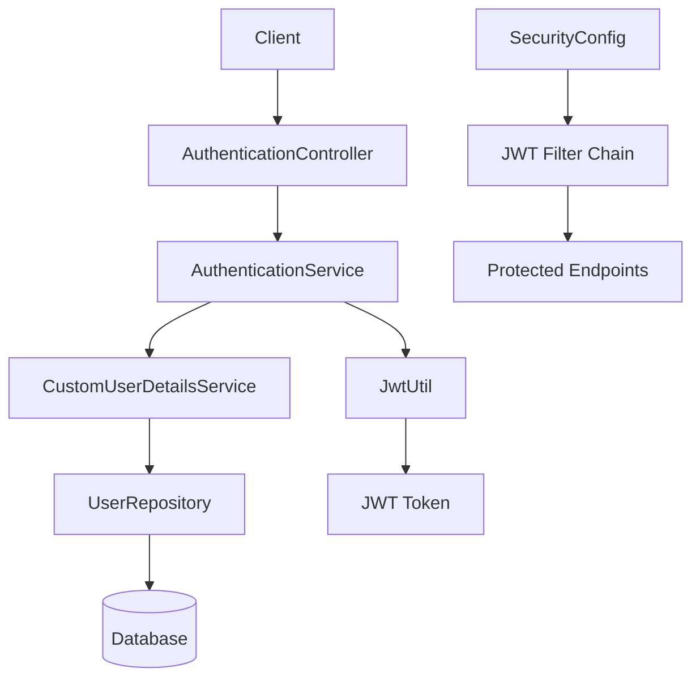
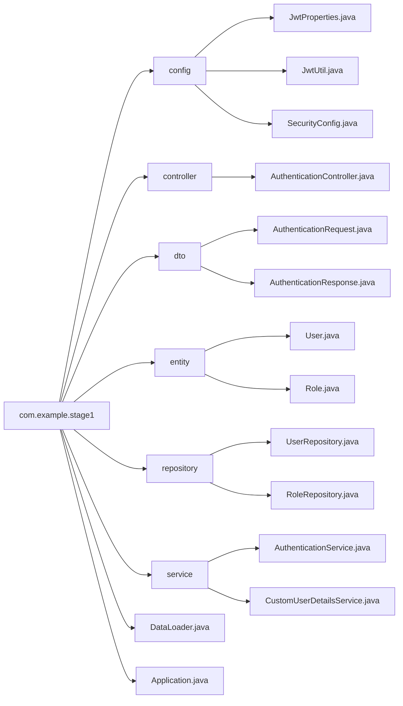
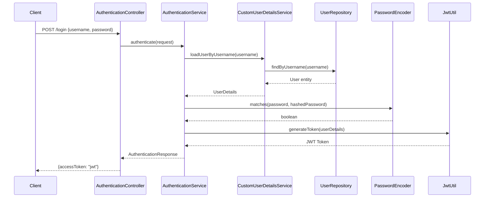

<div dir="rtl">

# תרגיל: בניית מערכת אימות JWT עם Spring Boot

## מטרת התרגיל

בתרגיל זה תלמדו לבנות מערכת אימות מלאה המבוססת על JWT (JSON Web Token) עם Spring Boot. המערכת תכלול:
- ניהול משתמשים ותפקידים
- אימות והרשאות
- הגנה על endpoints
- יצירה ואימות של JWT tokens

</div>

## ארכיטקטורת המערכת



## מבנה הפרויקט



<div dir="rtl">

## שלב 1: הגדרת הפרויקט

### צרו פרויקט Spring Boot חדש עם התלויות הבאות:

</div>

```xml
<dependencies>
    <!-- Spring Boot Starters -->
    <dependency>
        <groupId>org.springframework.boot</groupId>
        <artifactId>spring-boot-starter-data-jpa</artifactId>
    </dependency>
    <dependency>
        <groupId>org.springframework.boot</groupId>
        <artifactId>spring-boot-starter-security</artifactId>
    </dependency>
    <dependency>
        <groupId>org.springframework.boot</groupId>
        <artifactId>spring-boot-starter-web</artifactId>
    </dependency>

    <!-- JWT Dependencies -->
    <dependency>
        <groupId>io.jsonwebtoken</groupId>
        <artifactId>jjwt</artifactId>
        <version>0.12.6</version>
    </dependency>
    <dependency>
        <groupId>io.jsonwebtoken</groupId>
        <artifactId>jjwt-api</artifactId>
        <version>0.12.6</version>
    </dependency>
    <dependency>
        <groupId>io.jsonwebtoken</groupId>
        <artifactId>jjwt-impl</artifactId>
        <version>0.12.6</version>
        <scope>runtime</scope>
    </dependency>
    <dependency>
        <groupId>io.jsonwebtoken</groupId>
        <artifactId>jjwt-jackson</artifactId>
        <version>0.12.6</version>
        <scope>runtime</scope>
    </dependency>

    <!-- Database -->
    <dependency>
        <groupId>com.mysql</groupId>
        <artifactId>mysql-connector-j</artifactId>
        <scope>runtime</scope>
    </dependency>

    <!-- Utilities -->
    <dependency>
        <groupId>org.projectlombok</groupId>
        <artifactId>lombok</artifactId>
        <optional>true</optional>
    </dependency>
</dependencies>
```

<div dir="rtl">

## שלב 2: הגדרת מאגר הנתונים

צרו קובץ `application.properties`:

</div>

```properties
spring.application.name=Stage1

# Database Configuration
spring.datasource.url=jdbc:mysql://localhost:3306/the schema name you want to use
spring.datasource.username=root
spring.datasource.password=your password
spring.jpa.hibernate.ddl-auto=update

# Debug
spring.jpa.show-sql=true
```

<div dir="rtl">

## שלב 3: יצירת ישויות (Entities)

### 3.1 יצירת ישות Role

צרו קובץ `entity/Role.java`:

</div>

```java
package com.example.stage1.entity;

import com.fasterxml.jackson.annotation.JsonIgnore;
import jakarta.persistence.*;
import lombok.AllArgsConstructor;
import lombok.Getter;
import lombok.NoArgsConstructor;
import lombok.Setter;
import java.util.List;

@Setter
@Getter
@NoArgsConstructor
@AllArgsConstructor
@Entity
public class Role {
    @Id
    @GeneratedValue(strategy = GenerationType.AUTO)
    private Long id;

    @Column(nullable = false, unique = true)
    private String roleName;

    @ManyToMany(mappedBy="roles", fetch = FetchType.EAGER)
    @JsonIgnore
    private List<User> users;
}
```

<div dir="rtl">

### 3.2 יצירת ישות User

צרו קובץ `entity/User.java`:

</div>

```java
package com.example.stage1.entity;

import jakarta.persistence.*;
import lombok.AllArgsConstructor;
import lombok.Getter;
import lombok.NoArgsConstructor;
import lombok.Setter;
import java.util.List;

@Getter
@Setter
@NoArgsConstructor
@AllArgsConstructor
@Entity
public class User {
    @Id
    @GeneratedValue(strategy = GenerationType.AUTO)
    private Long id;

    @Column(nullable = false, unique = true, length = 80)
    private String username;

    @Column(nullable = false, length = 80)
    private String password;

    @ManyToMany(fetch = FetchType.EAGER)
    @JoinTable(
            name = "users_roles",
            joinColumns = @JoinColumn(name = "USER_ID"),
            inverseJoinColumns = @JoinColumn(name = "ROLE_ID"),
            uniqueConstraints = @UniqueConstraint(columnNames = {"USER_ID", "ROLE_ID"})
    )
    private List<Role> roles;
}
```

<div dir="rtl">

## שלב 4: יצירת Repositories

### 4.1 UserRepository

צרו קובץ `repository/UserRepository.java`:

</div>

```java
package com.example.stage1.repository;

import com.example.stage1.entity.User;
import org.springframework.data.jpa.repository.JpaRepository;

public interface UserRepository extends JpaRepository<User, Long> {
    User findUserByUsername(String username);
    User findByUsername(String username);
}
```

<div dir="rtl">

### 4.2 RoleRepository

צרו קובץ `repository/RoleRepository.java`:

</div>

```java
package com.example.stage1.repository;

import com.example.stage1.entity.Role;
import org.springframework.data.jpa.repository.JpaRepository;
import org.springframework.data.jpa.repository.Query;
import java.util.List;
import java.util.Optional;

public interface RoleRepository extends JpaRepository<Role, Long> {
    @Query("SELECT r FROM Role r JOIN r.users u WHERE u.id = :id")
    List<Role> findRolesByUserId(Long id);

    Optional<Role> findByRoleName(String role);
}
```

<div dir="rtl">

## שלב 5: יצירת DTOs

### 5.1 AuthenticationRequest

צרו קובץ `dto/AuthenticationRequest.java`:

</div>

```java
package com.example.stage1.dto;

import lombok.AllArgsConstructor;
import lombok.Getter;
import lombok.NoArgsConstructor;
import lombok.Setter;

/**
 * The AuthenticationRequest class is used to store the username and password
 * It is used in the authentication controller for login
 */
@Getter
@Setter
@NoArgsConstructor
@AllArgsConstructor
public class AuthenticationRequest {
    private String username;
    private String password;
}
```

<div dir="rtl">

### 5.2 AuthenticationResponse

צרו קובץ `dto/AuthenticationResponse.java`:

</div>

```java
package com.example.stage1.dto;

import lombok.AllArgsConstructor;
import lombok.Getter;
import lombok.NoArgsConstructor;
import lombok.Setter;

/**
 * The AuthenticationResponse class is used to store the access token
 * It is used in the authentication controller for login
 */
@Getter
@Setter
@NoArgsConstructor
@AllArgsConstructor
public class AuthenticationResponse {
    private String accessToken;
}
```

<div dir="rtl">

## שלב 6: הגדרת JWT

### 6.1 JwtProperties

צרו קובץ `config/JwtProperties.java`:

</div>

```java
package com.example.stage1.config;

public class JwtProperties {
    // The EXPIRATION_TIME constant is used to set the expiration time of the JWT
    // 5 minutes, it is recommended to set this to 30 minutes
    public static final int EXPIRATION_TIME = 300_000;
}
```

<div dir="rtl">

### 6.2 JwtUtil

צרו קובץ `config/JwtUtil.java`:

</div>

```java
package com.example.stage1.config;

import io.jsonwebtoken.Jwts;
import io.jsonwebtoken.security.Keys;
import org.springframework.security.core.GrantedAuthority;
import org.springframework.security.core.userdetails.UserDetails;
import org.springframework.stereotype.Component;

import javax.crypto.KeyGenerator;
import java.security.Key;
import java.security.NoSuchAlgorithmException;
import java.util.Date;
import java.util.HashMap;
import java.util.Map;
import java.util.stream.Collectors;

@Component
public class JwtUtil {
    private final Key key;

    public JwtUtil() {
        try {
            KeyGenerator secretKeyGen = KeyGenerator.getInstance("HmacSHA256");
            this.key = Keys.hmacShaKeyFor(secretKeyGen.generateKey().getEncoded());
        } catch (NoSuchAlgorithmException e) {
            throw new RuntimeException(e);
        }
    }

    private Key getKey() {
        return this.key;
    }

    // Generate a JWT token for a user, first time login
    public String generateToken(UserDetails userDetails) {
        Map<String, Object> claims = new HashMap<>();

        return Jwts.builder()
                .claims()
                .add(claims)
                .subject(userDetails.getUsername())
                .issuedAt(new Date(System.currentTimeMillis()))
                .expiration(new Date(System.currentTimeMillis() + JwtProperties.EXPIRATION_TIME))
                .and()
                .claim("roles", userDetails.getAuthorities().stream()
                        .map(GrantedAuthority::getAuthority)
                        .collect(Collectors.toList()))
                .claim("issuedBy", "learning JWT with Spring Security")
                .signWith(getKey())
                .compact();
    }
}
```

<div dir="rtl">

## שלב 7: הגדרת Spring Security

צרו קובץ `config/SecurityConfig.java`:

</div>

```java
package com.example.stage1.config;

import lombok.RequiredArgsConstructor;
import org.springframework.context.annotation.Bean;
import org.springframework.context.annotation.Configuration;
import org.springframework.security.config.annotation.web.builders.HttpSecurity;
import org.springframework.security.config.annotation.web.configuration.EnableWebSecurity;
import org.springframework.security.config.annotation.web.configurers.AbstractHttpConfigurer;
import org.springframework.security.config.http.SessionCreationPolicy;
import org.springframework.security.crypto.bcrypt.BCryptPasswordEncoder;
import org.springframework.security.crypto.password.PasswordEncoder;
import org.springframework.security.web.SecurityFilterChain;
import org.springframework.web.cors.CorsConfiguration;
import java.util.List;

@Configuration
@EnableWebSecurity
@RequiredArgsConstructor
public class SecurityConfig {

    @Bean
    public static PasswordEncoder passwordEncoder() {
        return new BCryptPasswordEncoder();
    }

    @Bean
    public SecurityFilterChain filterChain(HttpSecurity http) throws Exception {
        http
                .csrf(AbstractHttpConfigurer::disable)
                .cors(cors -> {
                    cors.configurationSource(request -> {
                        var corsConfig = new CorsConfiguration();
                        corsConfig.setAllowedOrigins(List.of("http://localhost:5173"));
                        corsConfig.setAllowedMethods(List.of("GET", "POST", "PUT", "DELETE", "OPTIONS"));
                        corsConfig.setAllowedHeaders(List.of("*"));
                        return corsConfig;
                    });
                })
                .sessionManagement(sess ->
                        sess.sessionCreationPolicy(SessionCreationPolicy.STATELESS))
                .authorizeHttpRequests(auth -> auth
                        .requestMatchers("/login/**").permitAll()
                        .requestMatchers("/welcome").authenticated()
                        .anyRequest().authenticated());

        return http.build();
    }
}
```

<div dir="rtl">

## שלב 8: יצירת Services

### 8.1 CustomUserDetailsService

צרו קובץ `service/CustomUserDetailsService.java`:

</div>

```java
package com.example.stage1.service;

import com.example.stage1.entity.Role;
import com.example.stage1.entity.User;
import com.example.stage1.repository.UserRepository;
import lombok.RequiredArgsConstructor;
import org.springframework.security.authentication.DisabledException;
import org.springframework.security.authentication.LockedException;
import org.springframework.security.core.GrantedAuthority;
import org.springframework.security.core.authority.SimpleGrantedAuthority;
import org.springframework.security.core.userdetails.UserDetails;
import org.springframework.security.core.userdetails.UserDetailsService;
import org.springframework.security.core.userdetails.UsernameNotFoundException;
import org.springframework.stereotype.Service;

import java.util.Collection;
import java.util.List;
import java.util.stream.Collectors;

@Service
@RequiredArgsConstructor
public class CustomUserDetailsService implements UserDetailsService {

    private final UserRepository userRepository;

    @Override
    public UserDetails loadUserByUsername(String username) throws UsernameNotFoundException {
        User user = userRepository.findByUsername(username);

        if (user != null) {
            UserDetails userDetails = new org.springframework.security.core.userdetails.User(
                    user.getUsername(),
                    user.getPassword(),
                    mapRolesToAuthorities(user.getRoles())
            );
            
            if (!userDetails.isEnabled()) {
                throw new DisabledException("User account is disabled");
            }

            if (!userDetails.isAccountNonLocked()) {
                throw new LockedException("User account is locked");
            }

            return userDetails;
        } else {
            System.out.println("Invalid username or password, or logged out.");
            return null;
        }
    }

    private Collection<? extends GrantedAuthority> mapRolesToAuthorities(List<Role> roles) {
        return roles.stream()
                .map(role -> new SimpleGrantedAuthority("ROLE_" + role.getRoleName()))
                .collect(Collectors.toList());
    }
}
```

<div dir="rtl">

### 8.2 AuthenticationService

צרו קובץ `service/AuthenticationService.java`:

</div>

```java
package com.example.stage1.service;

import com.example.stage1.config.JwtUtil;
import com.example.stage1.dto.AuthenticationRequest;
import com.example.stage1.dto.AuthenticationResponse;
import lombok.RequiredArgsConstructor;
import org.springframework.security.authentication.AuthenticationServiceException;
import org.springframework.security.core.userdetails.UserDetails;
import org.springframework.security.crypto.password.PasswordEncoder;
import org.springframework.stereotype.Service;

@Service
@RequiredArgsConstructor
public class AuthenticationService {

    private final CustomUserDetailsService customUserDetailsService;
    private final JwtUtil jwtUtil;
    private final PasswordEncoder passwordEncoder;

    /**
     * The authenticate() method takes in an AuthenticationRequest object,
     * which contains the username and password.
     * The method returns an AuthenticationResponse object,
     * which contains the JWT token.
     */
    public AuthenticationResponse authenticate(AuthenticationRequest authenticationRequest) {
        // Load the user details from the database
        UserDetails userDetails = customUserDetailsService.loadUserByUsername(
                authenticationRequest.getUsername());

        // Check if the password matches
        if (!passwordEncoder.matches(authenticationRequest.getPassword(), userDetails.getPassword())) {
            throw new AuthenticationServiceException("Invalid credentials");
        }

        // Generate the JWT token
        String jwtToken = jwtUtil.generateToken(userDetails);

        // Return the AuthenticationResponse object
        return new AuthenticationResponse(jwtToken);
    }
}
```

<div dir="rtl">

## שלב 9: יצירת Controller

צרו קובץ `controller/AuthenticationController.java`:

</div>

```java
package com.example.stage1.controller;

import com.example.stage1.dto.AuthenticationRequest;
import com.example.stage1.dto.AuthenticationResponse;
import com.example.stage1.service.AuthenticationService;
import lombok.RequiredArgsConstructor;
import org.springframework.http.HttpStatus;
import org.springframework.http.ResponseEntity;
import org.springframework.security.authentication.AuthenticationServiceException;
import org.springframework.stereotype.Controller;
import org.springframework.web.bind.annotation.GetMapping;
import org.springframework.web.bind.annotation.PostMapping;
import org.springframework.web.bind.annotation.RequestBody;

@Controller
@RequiredArgsConstructor
public class AuthenticationController {

    private final AuthenticationService authenticationService;

    @PostMapping("/login")
    public ResponseEntity<?> authenticateUser(@RequestBody AuthenticationRequest authenticationRequest) {
        try {
            AuthenticationResponse authResponse = authenticationService.authenticate(authenticationRequest);

            System.out.println("username: " + authenticationRequest.getUsername());
            System.out.println("jwt token: " + authResponse.getAccessToken());

            return ResponseEntity.ok(authResponse);
        } catch (AuthenticationServiceException e) {
            return ResponseEntity.status(HttpStatus.UNAUTHORIZED).body(e.getMessage());
        }
    }

    @GetMapping("/welcome")
    public ResponseEntity<String> welcome() {
        return ResponseEntity.ok("Welcome to the Stage 1 application!");
    }
}
```

<div dir="rtl">

## שלב 10: יצירת DataLoader

צרו קובץ `DataLoader.java`:

</div>

```java
package com.example.stage1;

import com.example.stage1.entity.Role;
import com.example.stage1.entity.User;
import com.example.stage1.repository.RoleRepository;
import com.example.stage1.repository.UserRepository;
import lombok.RequiredArgsConstructor;
import org.springframework.boot.CommandLineRunner;
import org.springframework.security.crypto.password.PasswordEncoder;
import org.springframework.stereotype.Component;

import java.util.ArrayList;
import java.util.List;

@Component
@RequiredArgsConstructor
public class DataLoader implements CommandLineRunner {

    private final UserRepository userRepository;
    private final RoleRepository roleRepository;
    private final PasswordEncoder passwordEncoder;

    @Override
    public void run(String... args) {
        // Check if the database is empty
        if (userRepository.count() > 0) {
            return;
        }

        // Create roles
        Role adminRole = new Role();
        adminRole.setRoleName("ADMIN");
        roleRepository.save(adminRole);

        Role userRole = new Role();
        userRole.setRoleName("USER");
        roleRepository.save(userRole);

        // Create admin user
        User adminUser = new User();
        adminUser.setUsername("admin");
        adminUser.setPassword(passwordEncoder.encode("admin"));
        List<Role> roles = new ArrayList<>();
        roles.add(adminRole);
        roles.add(userRole);
        adminUser.setRoles(roles);
        userRepository.save(adminUser);

        // Create regular user
        User user = new User();
        user.setUsername("user");
        user.setPassword(passwordEncoder.encode("user"));
        List<Role> userRoles = new ArrayList<>();
        userRoles.add(userRole);
        user.setRoles(userRoles);
        userRepository.save(user);
    }
}
```

<div dir="rtl">

## שלב 11: בדיקת המערכת

### 11.1 הרצת האפליקציה

הריצו את האפליקציה עם:

</div>

```bash
mvn spring-boot:run
```

<div dir="rtl">

### 11.2 בדיקת הלוגין
השתמשו בקובץ: stage1-jwt-tests-fixed.http

## תרשים זרימת האימות



<div dir="rtl">

## משימות נוספות שיושלמו בהמשך השיעור

1. **הוספת JWT Filter**: הוסיפו פילטר שיבדוק את ה-JWT בכל בקשה
2. **הוספת Refresh Token**: הוסיפו מנגנון של refresh tokens
3. **הוספת Role-based Authorization**: הוסיפו הרשאות על בסיס תפקידים
4. **הוספת Exception Handling**: הוסיפו טיפול מתקדם בשגיאות
5. **הוספת Logout**: הוסיפו מנגנון logout עם blacklist של tokens

## נקודות חשובות לזכור להמשך

- **אבטחה**: אל תשמרו את ה-secret key בקוד הייצור
- **Token Expiration**: הגדירו זמן תפוגה סביר לטוקנים
- **Password Encoding**: תמיד הצפינו סיסמאות לפני שמירה
- **CORS**: הגדירו CORS נכון עבור יישום ה-frontend
- **Error Handling**: טפלו בשגיאות בצורה מתאימה

</div>